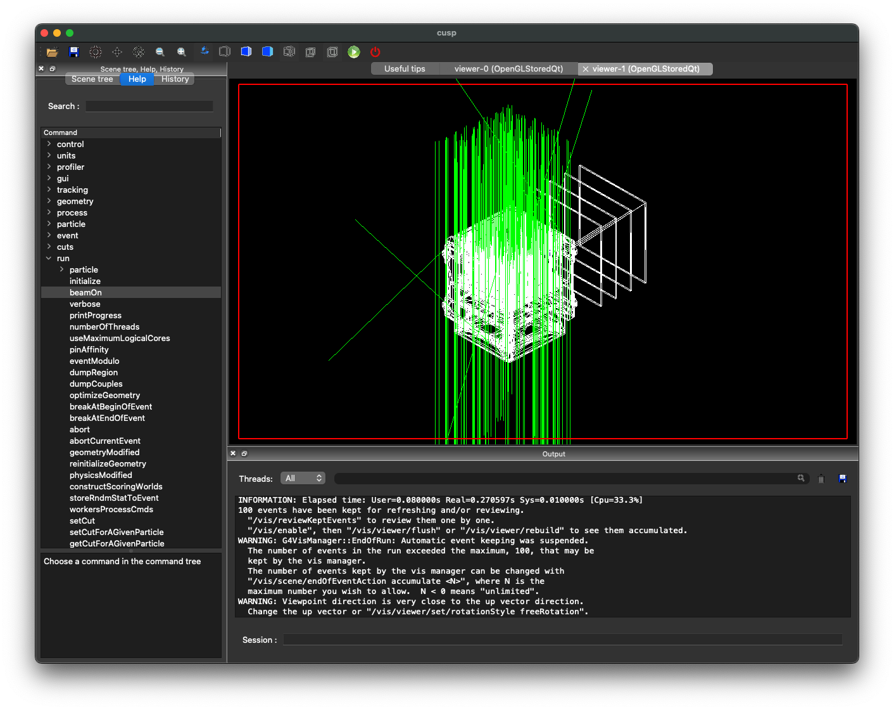

# g4cusp

__A GEANT4 code to simulate the CUSP detector__

The code is released under MIT licence. Please, read the `LICENCE` file in the root dir. The copyright notice shall be included in all copies or substantial portions of the Software.

__Warning:__ this code is under developement and the usage requires a basic understanding of how GEANT4 works.

## Usage

Interactive mode:
`./cusp_gdml`

Batch mode:
`./cusp_gdml batch.mac`

